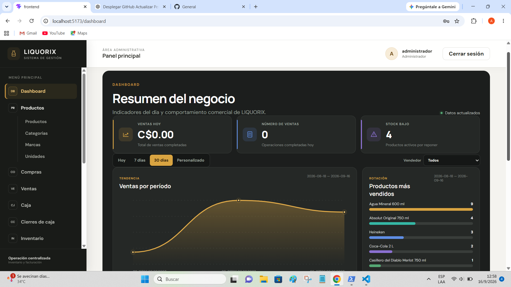
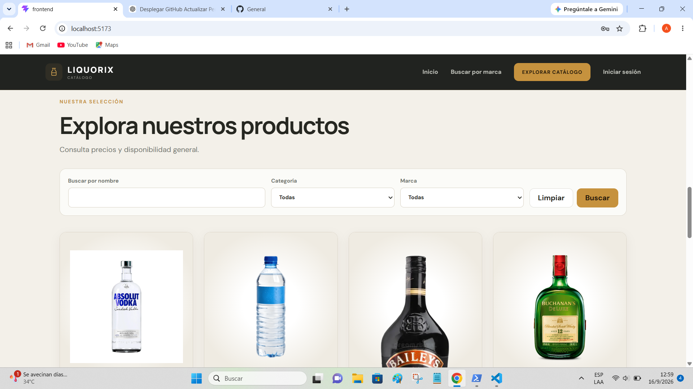
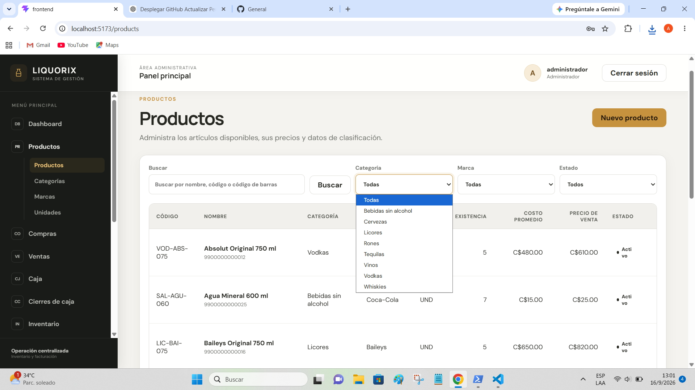
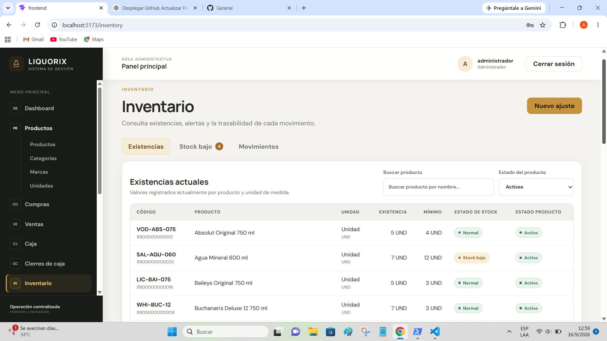
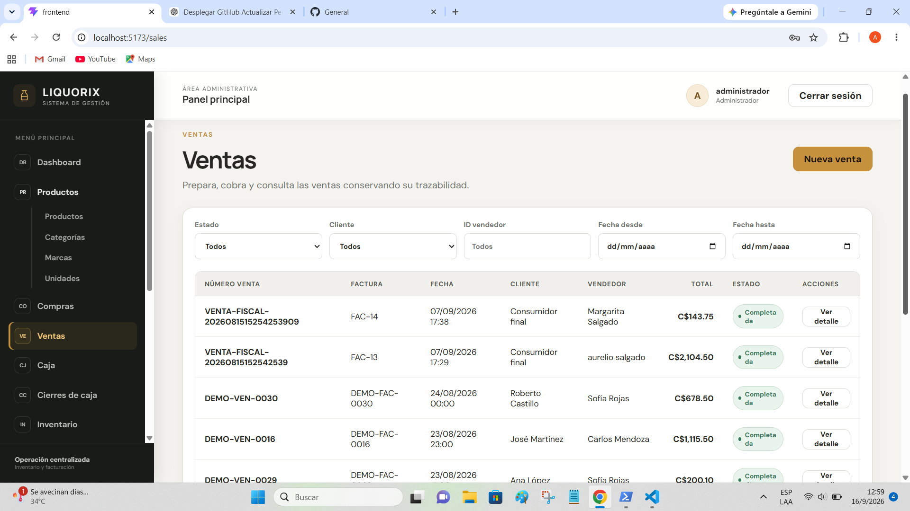
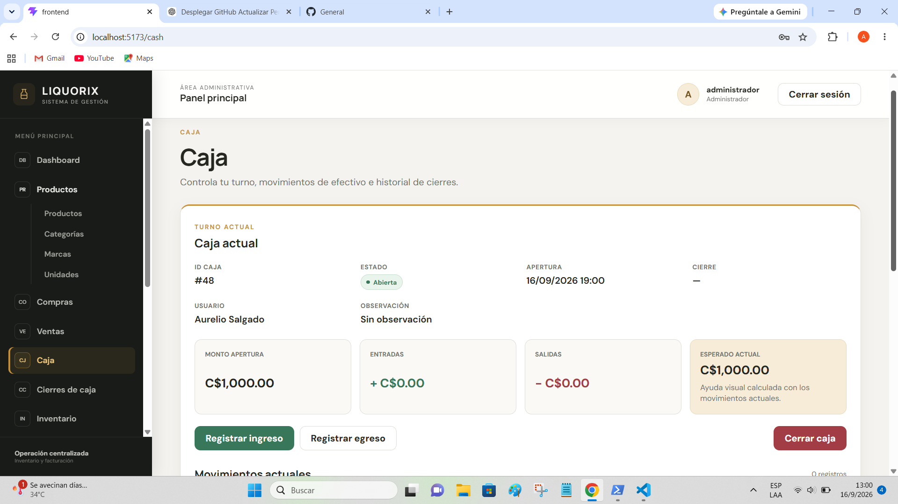
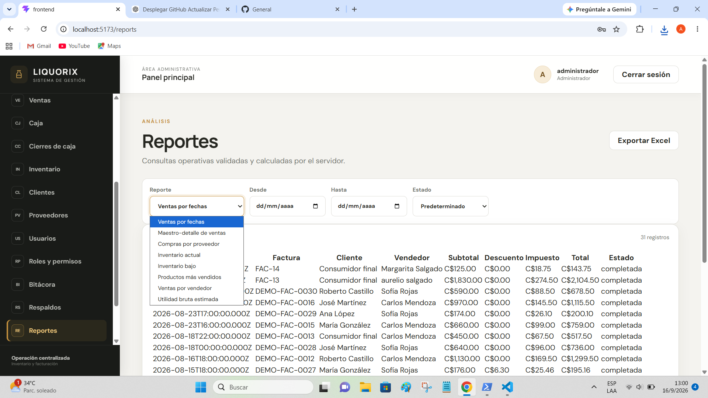

<div align="center">

# 🥃 LIQUORIX

### Sistema Web de Inventario y Facturación

Aplicación web full-stack para la gestión integral de inventario, compras, ventas, facturación y operaciones administrativas de una licorería.

</div>

---



## 📌 Sobre el proyecto

**LIQUORIX** es un sistema web desarrollado para centralizar y automatizar las principales operaciones de una licorería.

La aplicación integra en una misma plataforma la administración de productos, inventario, compras, ventas, facturación, caja, clientes, proveedores, usuarios, reportes y respaldos.

El proyecto fue desarrollado siguiendo una arquitectura **frontend/backend desacoplada**, utilizando una API REST para la comunicación entre la interfaz web y el servidor.

Entre sus objetivos principales se encuentran mejorar el control de existencias, mantener la trazabilidad de las operaciones y proporcionar información útil para la administración del negocio.

## 🛠️ Tecnologías

### Frontend


### Backend


### Base de datos


### Herramientas


## ✨ Características principales

- Dashboard administrativo con indicadores y comportamiento comercial.
- Gestión de productos, categorías, marcas y unidades.
- Control de inventario y alertas de stock bajo.
- Registro y trazabilidad de movimientos de inventario.
- Gestión de compras y proveedores.
- Registro de ventas y facturación.
- Administración de clientes.
- Apertura, movimientos y cierre de caja.
- Supervisión de cierres de caja.
- Gestión de usuarios.
- Sistema de roles y permisos.
- Bitácora de operaciones.
- Generación de reportes administrativos.
- Exportación de información a Excel.
- Catálogo público de productos.
- Gestión de respaldos y recuperación.
- Autenticación y control de acceso mediante JWT.

## 🧩 Módulos del sistema

LIQUORIX está organizado en módulos independientes que cubren las principales áreas operativas del negocio:

| Módulo | Función |
|---|---|
| Dashboard | Indicadores de ventas, stock y comportamiento comercial |
| Productos | Administración del catálogo interno |
| Inventario | Existencias, stock mínimo y movimientos |
| Compras | Registro de compras y actualización de existencias |
| Ventas | Facturación y trazabilidad de operaciones |
| Caja | Apertura, ingresos, egresos y cierre |
| Clientes | Administración de clientes |
| Proveedores | Gestión de proveedores |
| Usuarios | Administración de cuentas del sistema |
| Roles y permisos | Control de acceso según responsabilidades |
| Bitácora | Registro de operaciones relevantes |
| Reportes | Consultas administrativas y exportación |
| Respaldos | Copias de seguridad y recuperación |
| Catálogo público | Consulta de productos sin autenticación |

## 🏗️ Arquitectura

El proyecto utiliza una arquitectura web cliente-servidor:

```text
┌──────────────────────────┐
│        React + Vite      │
│         Frontend         │
└────────────┬─────────────┘
             │
             │ HTTP / JSON
             ▼
┌──────────────────────────┐
│    Node.js + Express     │
│        REST API          │
└────────────┬─────────────┘
             │
             ▼
┌──────────────────────────┐
│      MariaDB / MySQL     │
│       Base de datos      │
└──────────────────────────┘
```

## 📸 Capturas del sistema

### 🌐 Catálogo público

Los visitantes pueden explorar el catálogo de productos sin necesidad de iniciar sesión.



### 📦 Gestión de productos

Administración de productos con búsqueda y filtros por categoría, marca y estado.



### 📊 Control de inventario

Visualización de existencias, stock mínimo, alertas y movimientos de inventario.



### 🧾 Ventas y facturación

Registro y consulta de ventas, manteniendo la trazabilidad de las operaciones realizadas.



### 💵 Control de caja

Gestión de apertura, ingresos, egresos y cierre de caja.



### 📈 Reportes

Generación de reportes administrativos con diferentes criterios de consulta y exportación de información.



## Requisitos

- Node.js compatible con las dependencias del proyecto y con el ejecutor `node:test`.
- npm.
- MariaDB/MySQL compatible.
- Git, si se clonará el repositorio.

## Clonar y preparar el proyecto

```powershell
git clone RUTA_O_URL_DEL_REPOSITORIO sistema-licoreria
cd sistema-licoreria
```

## Backend

Instale las dependencias versionadas desde el directorio raíz:

```powershell
npm --prefix backend install
```

También puede entrar en `backend` y ejecutar `npm install`.

## Crear la base de datos

Use una cuenta administradora de MariaDB para crear la base. No es necesario usar `root` durante la ejecución normal del backend.

```sql
CREATE DATABASE sistema_licoreria
    CHARACTER SET utf8mb4
    COLLATE utf8mb4_unicode_ci;
```

Los archivos `database/schema.sql` y `database/seed.sql` no seleccionan una base: el destino debe indicarse externamente al ejecutarlos.

## Crear el usuario de aplicación

Ejecute como administrador de MariaDB y reemplace obligatoriamente la contraseña de ejemplo:

```sql
CREATE USER 'usuario_aplicacion'@'localhost'
    IDENTIFIED BY 'CAMBIAR_POR_PASSWORD_SEGURA';

GRANT SELECT, INSERT, UPDATE, DELETE
    ON sistema_licoreria.*
    TO 'usuario_aplicacion'@'localhost';
```

Si el backend se conecta desde otro host, ajuste de forma restrictiva la parte `@'localhost'`. El usuario runtime no necesita `CREATE USER`, `GRANT OPTION`, `DROP DATABASE` ni privilegios administrativos. Una cuenta administradora se utiliza únicamente para crear la base, crear el usuario, conceder privilegios y aplicar el schema y el seed cuando corresponda.

## Aplicar el schema

Desde el directorio raíz, indique explícitamente la base en el cliente:

```cmd
mysql -u root -p sistema_licoreria < database/schema.sql
```

Como alternativa, desde la consola de MariaDB:

```sql
USE sistema_licoreria;
SOURCE C:/ruta/al/proyecto/database/schema.sql;
```

## Aplicar el seed

Después del schema:

```cmd
mysql -u root -p sistema_licoreria < database/seed.sql
```

O desde la consola que ya tiene seleccionada la base:

```sql
SOURCE C:/ruta/al/proyecto/database/seed.sql;
```

El seed carga roles, permisos, métodos de pago, unidades iniciales, el cliente “Consumidor final” y la configuración base.

## Crear `.env`

Copie `backend/.env.example` como `backend/.env` y reemplace todos los valores marcados para cambio:

```powershell
Copy-Item backend/.env.example backend/.env
```

La correspondencia con MariaDB es:

- `DB_HOST`: servidor de MariaDB.
- `DB_PORT`: puerto del servidor.
- `DB_NAME`: base creada para Liquorix.
- `DB_USER`: usuario de aplicación al que se concedieron los privilegios DML.
- `DB_PASSWORD`: contraseña asignada a ese usuario.

Defina además un `JWT_SECRET` largo y aleatorio. `backend/.env` está ignorado por Git y no debe versionarse.

## Crear el Administrador inicial

El seed crea el rol Administrador, pero no almacena credenciales. Después de configurar `.env`, defina temporalmente estas variables en la sesión de PowerShell:

```powershell
$env:ADMIN_NAME='Nombre'
$env:ADMIN_LASTNAME='Apellido'
$env:ADMIN_USERNAME='administrador'
$env:ADMIN_EMAIL='admin@example.test'
$env:ADMIN_PASSWORD='CAMBIAR_POR_PASSWORD_SEGURA'
npm --prefix backend run create-admin
Remove-Item Env:ADMIN_NAME,Env:ADMIN_LASTNAME,Env:ADMIN_USERNAME,Env:ADMIN_EMAIL,Env:ADMIN_PASSWORD
```

`ADMIN_EMAIL` es opcional y puede omitirse. La contraseña debe tener al menos 12 caracteres y no superar 72 bytes en UTF-8, límite aplicado por la política actual. El script genera el hash con bcrypt y no guarda la contraseña en texto plano. No comparta ni incluya `ADMIN_PASSWORD` en archivos versionados.

## Arrancar el backend

Modo normal:

```powershell
npm --prefix backend start
```

Modo de desarrollo con recarga:

```powershell
npm --prefix backend run dev
```

## Verificar health

Con el backend iniciado, consulte:

```text
GET http://localhost:3000/api/v1/health
```

Una respuesta correcta informa `status: "ok"` y `database: "ok"`.

## Login

El inicio de sesión se realiza mediante JSON en:

```text
POST http://localhost:3000/api/v1/auth/login
```

Use las credenciales creadas durante el despliegue; no las agregue a la documentación ni al repositorio.

## Ejecutar pruebas

```powershell
npm --prefix backend run check
npm --prefix backend test
```

La suite actual utiliza `node:test`. Sus pruebas unitarias emplean dependencias controladas y no requieren conectarse a una instancia real de MariaDB.

## Preparar datos para la demostración

Los scripts `database/demo-reset.sql` y `database/demo-sales.sql` preparan un
dataset controlado para la defensa. No forman parte de la instalación ordinaria ni
deben ejecutarse directamente sin ensayarlos primero sobre una base temporal
aislada. El propósito, orden, precondiciones, validaciones y criterios de
`COMMIT`/`ROLLBACK` se describen en `docs/08-pruebas.md`. Los scripts no deben
ejecutarse durante las pruebas automatizadas.

## Orden recomendado de instalación

1. Crear la base de datos.
2. Crear el usuario de aplicación y conceder privilegios DML.
3. Aplicar `database/schema.sql` sobre la base seleccionada.
4. Aplicar `database/seed.sql` sobre esa misma base.
5. Crear y completar `backend/.env`.
6. Crear el Administrador inicial.
7. Iniciar el backend.
8. Verificar health y login.

## Seguridad

- No versionar ni compartir `backend/.env`.
- No compartir `ADMIN_PASSWORD`, `JWT_SECRET` ni tokens.
- Cambiar todas las contraseñas y secretos de ejemplo.
- No usar `root` ni otra cuenta administradora como usuario runtime en producción.
- Conceder al usuario de aplicación únicamente los privilegios necesarios sobre la base de Liquorix.
